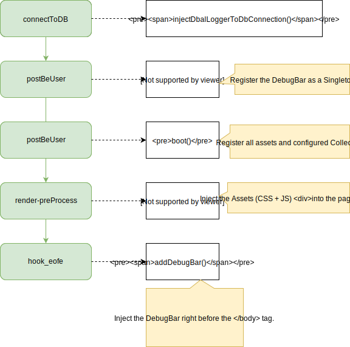

===============
TYPO3 Debug Bar
===============

|Build Status| |Latest Stable Version| |Total Downloads| |Latest Unstable Version|
|License|

This is a package to integrate `PHP Debug
Bar <http://phpdebugbar.com/>`__ with TYPO3. It uses several hooks to
include the assets and itself into frontend output. It bootstraps some
Collectors to work with TYPO3 and implements a couple custom
DataCollectors, specific for TYPO3.

Read `the documentation <http://phpdebugbar.com/docs/>`__ for more
configuration options.

.. figure:: https://raw.githubusercontent.com/konafets/typo3_debugbar/develop/Documentation/Images/SQLView.png
   :alt: Screenshot

**Info**: Use the DebugBar only in development. It can slow the
application down (because it has to gather data). So when experiencing
slowness, try disabling some of the collectors.

The extension comes with the default collectors:

-  PhpInfoCollector: Show the PHP version
-  MessagesCollector: Collects messages from within the Application and
   pushing them to the DebugBar
-  TimeDataCollector: Here you can start and stop a timer. Default it
   times the Application. More in the Usage section
-  MemoryCollector: Show the Memory usage
-  ExceptionsCollector: Collects exceptions from withing the Application
   and pushing them to the DebugBar

And includes some custom collectors:

-  InfoCollector: Show the same information like the Info pane of the
   Admin Panel
-  MySqliCollector: Show all queries, including timing and the values of
   prepared statements
-  Typo3Collector: Show the TYPO3 version, Locale and Environment
-  AuthCollector: Show the username of the logged-in backend user
-  SessionCollector: Show session data

************
Installation
************

Require this package with composer. It is recommended to only require
the package for development.

.. code:: shell

    composer require konafets/typo3_debugbar --dev

Afterwards you need to activate the extension in the Extension Manager.
The DebugBar is enabled by default and will be displayed to you if you
are logged into the backend as an administrator.

*****
Usage
*****

The extension is configurable through the Extension Manager. There you
can enable/disable the DebugBar as well as the DataCollectors.

|Configuration|

Use it everywhere
-----------------

The Typo3DebugBar implements the ``SingletonInterface``, therefore you
can get the same instance via ``debugbar()``. This opens the
possibility to interact with the DebugBar from within TYPO3.

Log Exceptions
^^^^^^^^^^^^^

.. code:: php

    try {
        throw new Exception('foobar');
    } catch (Exception $e) {
        debugBar()->addThrowable($e);
    }

These will be shown in the Exception pane.

Add messages
^^^^^^^^^^^^

.. code:: php

    debugBar()->info($object);
    debugBar()->error('Error!');
    debugBar()->warning('Watch out…');
    debugBar()->addMessage('Another message', 'mylabel');

.. figure:: https://raw.githubusercontent.com/konafets/typo3_debugbar/develop/Documentation/Images/MessagesPane.png
   :alt: MessagesPane

Add timers
^^^^^^^^^^

And start/stop timing:

.. code:: php

    debugBar()->startMeasure('render', 'Time for rendering');
    debugBar()->stopMeasure('render');
    debugBar()->addMeasure('now', TYPO3_START, microtime(true));
    debugBar()->measure('My long operation', function() {
        // Do something…
    });
    debugbar_debug($value);

or even shorter:

.. code:: php

    startMeasure('render', 'Time for rendering');
    stopMeasure('render');
    addMeasure('now', TYPO3_START, microtime(true));
    measure('My long operation', function() {
        // Do something…
    });

Database
--------

This pane shows all issued queries of the connection with the name *Default*. Is there is no connection with this name, the first connection of the ``ConnectionPool`` will be used.

With placeholders
^^^^^^^^^^^^^^^^^

Per default, the statements were shown as Prepared Statements, meaning the placeholders are inside the statement while the actual values are in a hidden table below each statement. To see them, click on the statement.

.. figure:: https://raw.githubusercontent.com/konafets/typo3_debugbar/develop/Documentation/Images/DatabasePane.gif
   :alt: DatabasePane

With params
^^^^^^^^^^^

To render the values directly inside the statements, activate the option ``with_params`` in the extension settings.

Info: The extension uses the *connectToDB* hook to
inject ``Doctrine\DBAL\Logging\DebugStack`` as a logger to the
connection. At the end of the rendering process it retrieves the Logger
and shows the logged queries. Its important to understand, that the
extension adds ``Doctrine\DBAL\Logging\DebugStack`` in any case, even if
its not shown in the frontend. This is due to log *all* queries from the
very beginning ... but at that point the BE User is not initialized yet
and its unclear if the DebugBar is enabled or not. Classical
*Chicken-and-egg* problem.

VarDump
-------

Everybody knows the output of DebugUtility::var_dump() ... and everybody knows that it breaks the layout. Lets move the output
to the TYPO3 Debugbar. Use ``Konafets\Typo3Debugbar\Overrides\DebuggerUtility::var_dump($variable)`` and get an output like this:

.. figure:: https://raw.githubusercontent.com/konafets/typo3_debugbar/develop/Documentation/Images/VarDumpPane.png
   :alt: VarDumpPane

ViewHelper
----------

The extension comes with a ViewHelper included to pipe the content of a variable to the DebugBar.

.. code:: html

    {namespace k=Konafets\Typo3Debugbar\ViewHelpers}

    <k:debugbar>{teaser}</k:debugbar>

*********
Lifecycle
*********

As mentioned above the extension uses hooks. The following figure shows
the usage during a request life cycle.

*******
Credits
*******

The extension is heavily inspired by the `Laravel
Debugbar <https://github.com/barryvdh/laravel-debugbar>`__. Thanks for
your good work `Barry vd. Heuvel <https://github.com/barryvdh>`__. I
also copied the idea of a ServiceProvider from Laravel.

The idea and the initial version of the ViewHelper was provided by `@KaffDaddy <https://github.com/KaffDaddy>`__.

.. |Build Status| image:: https://travis-ci.org/Konafets/typo3_debugbar.svg?branch=master
   :target: https://travis-ci.org/Konafets/typo3_debugbar
.. |Latest Stable Version| image:: https://poser.pugx.org/konafets/typo3_debugbar/v/stable
   :target: https://packagist.org/packages/konafets/typo3_debugbar
.. |Total Downloads| image:: https://poser.pugx.org/konafets/typo3_debugbar/downloads
   :target: https://packagist.org/packages/konafets/typo3_debugbar
.. |Latest Unstable Version| image:: https://poser.pugx.org/konafets/typo3_debugbar/v/unstable
   :target: https://packagist.org/packages/konafets/typo3_debugbar
.. |License| image:: https://poser.pugx.org/konafets/typo3_debugbar/license
   :target: https://packagist.org/packages/konafets/typo3_debugbar
.. |Configuration| image:: https://raw.githubusercontent.com/konafets/typo3_debugbar/develop/Documentation/Images/Configure.png
